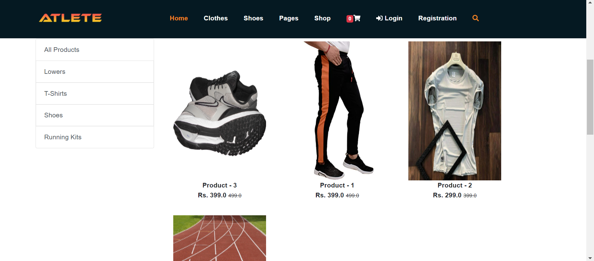

# Atlete
Atlete complete fully functional ecommerce website built with Python and Django offers ecom facility along with blogs and news.

https://github.com/devmansh/Atlete/blob/main/screenshots/SC%20(1).png

## 📸 Features

## Built With 🛠
- [HTML](https://www.w3schools.com/html/)
- [CSS](https://www.w3schools.com/css/)
- [BOOTSTRAP](https://www.w3schools.com/bootstrap/)
- [JS](https://www.w3schools.com/js/)
- [PYTHON](https://www.python.org/)
- [DJANGO](https://www.djangoproject.com/) 
  
## Backend 🛠
  - [PYTHON](https://www.python.org/)
  - [DJANGO](https://www.djangoproject.com/)
  
## Contact
If you need any help, you can connect with me.

Visit:- [Manoj Sharma](https://devmansh.github.io) | [LinkedIn](https://linkedin.com/in/devmansh) | [Instagram](https://www.instagram.com/themohitsharma.in/)
